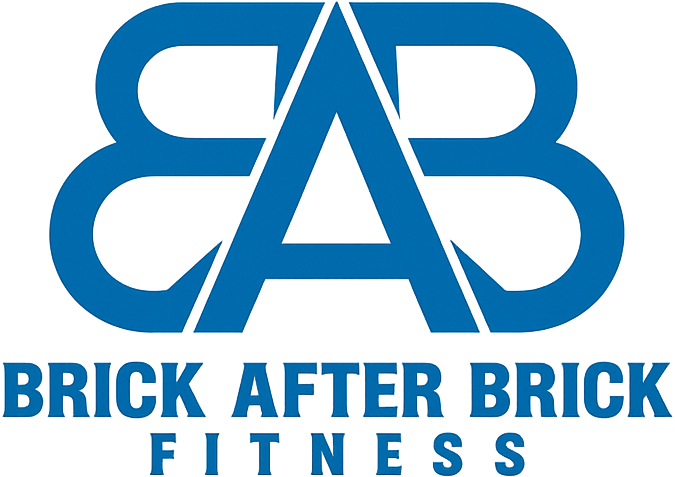

# 🏋️‍♂️ Gym App

A comprehensive fitness tracking and nutrition management application built with React Native and Expo, featuring a modern dark UI and data-driven architecture.



## ✨ Features

### 🏠 **Home Dashboard**
- **Daily Progress Tracking**: Visual progress circles for workouts, steps, and calories
- **Quick Start Workouts**: Fast access to popular workout routines
- **Recent Activity Feed**: Track your latest fitness activities
- **Featured Video Content**: Curated workout videos and tutorials
- **Workout Streak Tracking**: Monitor consistency with streak counters

### 🍽️ **Meal Planning**
- **Macro Tracking**: Comprehensive tracking of proteins, carbs, fats, and calories
- **Daily Meal Management**: Plan and track breakfast, lunch, dinner, and snacks
- **Recent Meals**: Quick access to frequently eaten foods
- **Food Database**: Extensive food search and nutrition information
- **Weekly Meal Planning**: Plan meals in advance for the entire week
- **Dietary Preferences**: Support for various dietary restrictions and preferences

### 💪 **Training & Workouts**
- **Workout Library**: Browse from a variety of strength, cardio, and specialized workouts
- **Continue Workout**: Resume in-progress workout sessions
- **Today's Workout**: Personalized daily workout recommendations
- **Exercise Library**: Comprehensive database of exercises with instructions
- **Workout Progress**: Track sets, reps, weights, and workout duration
- **Recent Workouts**: View workout history and performance trends

### 📅 **Calendar & Analytics**
- **Workout Calendar**: Visual calendar showing workout history and streaks
- **Progress Charts**: Track weight, body fat, and other metrics over time
- **Steps Analytics**: Daily and weekly step tracking with bar graphs
- **Activity Analytics**: Comprehensive overview of fitness activities
- **Goal Setting**: Set and track fitness goals
- **Streak Visualization**: See workout consistency patterns

### 👤 **User Management**
- **Profile Management**: Comprehensive user profiles with fitness goals
- **Body Composition Tracking**: Monitor body fat percentage and physical changes
- **Registration Process**: Step-by-step onboarding with personalized setup
- **Subscription Management**: Handle premium features and billing
- **Settings & Preferences**: Customize app experience and notifications

### 🔧 **Admin Dashboard**
- **User Analytics**: Monitor user engagement and app usage
- **Content Management**: Manage workouts, meals, and educational content
- **Subscription Management**: Handle user subscriptions and billing
- **Chat Support**: Built-in support system for user assistance
- **Badge System**: Gamification features for user motivation

## 🏗️ Architecture

### **Data-Driven Design**
- **Service Layer**: Centralized data services for Calendar, MealPlan, and Training modules
- **Component Separation**: Clear separation between UI components and data logic
- **Mock Data Integration**: Ready for backend integration with comprehensive mock data
- **Real-time Updates**: Optimistic UI updates with proper error handling

### **Tech Stack**
- **Frontend**: React Native with Expo
- **Navigation**: Expo Router for file-based routing
- **UI Components**: Custom components with consistent design system
- **Charts**: React Native Chart Kit for data visualization
- **Notifications**: Expo Notifications for push notifications
- **Authentication**: Firebase Authentication
- **State Management**: React hooks with centralized data services

## 🚀 Planned Features

### **Backend Integration**
- **Supabase Database**: Complete backend migration to Supabase for data persistence
- **Real-time Sync**: Synchronization across devices with real-time updates
- **User Authentication**: Enhanced authentication and user management
- **Cloud Storage**: Exercise videos and user-generated content storage
- **API Integration**: RESTful APIs for all data operations

### **Enhanced Features**
- **AI Workout Recommendations**: Personalized workout suggestions based on user history
- **Social Features**: Connect with friends and share progress
- **Wearable Integration**: Sync with fitness trackers and smartwatches
- **Video Workouts**: Integrated video streaming for guided workouts
- **Nutrition AI**: Smart meal recommendations based on fitness goals

## 🚀 Quick Start Guide

### Prerequisites

Before you begin, ensure you have the following installed:
- **Node.js** (v16 or higher)
- **npm** or **yarn**
- **Expo CLI**: `npm install -g expo-cli`
- **Expo Go app** on your mobile device (for testing)

### Installation

1. **Clone the repository**
   ```bash
   git clone https://github.com/MattJerson/Gym-App.git
   cd Gym-App
   ```

2. **Install dependencies**
   ```bash
   npm install
   ```

3. **Set up environment configuration**
   ```bash
   # Copy the example environment file
   cp .env.example .env
   
   # Edit .env with your configuration
   # Add your Firebase configuration details
   ```

4. **Start the development server**
   ```bash
   npm start
   ```

5. **Run on your device**
   - **iOS**: `npm run ios` (requires Xcode)
   - **Android**: `npm run android` (requires Android Studio)
   - **Web**: `npm run web`
   - **Expo Go**: Scan the QR code with your device

### Admin Dashboard Setup

The app includes a separate admin dashboard built with React and Vite:

1. **Navigate to admin directory**
   ```bash
   cd admin
   ```

2. **Install admin dependencies**
   ```bash
   npm install
   ```

3. **Start admin development server**
   ```bash
   npm run dev
   ```

4. **Access admin dashboard**
   - Open `http://localhost:5173` in your browser

### Firebase Configuration

1. **Create a Firebase project** at [Firebase Console](https://console.firebase.google.com/)

2. **Enable Authentication and Firestore**

3. **Copy configuration** to `app/config/firebaseconfig.js`:
   ```javascript
   const firebaseConfig = {
     apiKey: "your-api-key",
     authDomain: "your-auth-domain",
     projectId: "your-project-id",
     storageBucket: "your-storage-bucket",
     messagingSenderId: "your-messaging-sender-id",
     appId: "your-app-id"
   };
   ```

### Project Structure

```
gym-app/
├── app/                    # Main application screens
│   ├── auth/              # Authentication screens
│   ├── features/          # Feature-specific screens
│   ├── page/              # Main app pages
│   ├── settings/          # Settings screens
│   └── training/          # Training-related screens
├── admin/                 # Admin dashboard (React/Vite)
├── components/            # Reusable UI components
├── services/              # Data services and API calls
├── assets/                # Images and static assets
└── supabase/             # Supabase configuration
```

### Development Tips

1. **Hot Reload**: Changes automatically reload in Expo Go
2. **Component Development**: Each feature has its own component folder
3. **Data Services**: Mock data is available in `/services` folder
4. **Styling**: Consistent design system with dark theme
5. **Navigation**: File-based routing with Expo Router

### Building for Production

1. **Build the app**
   ```bash
   npm run build
   ```

2. **Create production builds**
   ```bash
   # For iOS
   expo build:ios
   
   # For Android
   expo build:android
   ```

### Troubleshooting

- **Metro bundler issues**: `npm start -- --clear`
- **Node modules issues**: `rm -rf node_modules && npm install`
- **iOS simulator issues**: Reset simulator in Xcode
- **Android issues**: Check Android SDK configuration

## 📱 Screenshots

*Coming soon - Screenshots of the app in action*

## 🤝 Contributing

We welcome contributions! Please see our [Contributing Guidelines](CONTRIBUTING.md) for details.

1. Fork the repository
2. Create your feature branch (`git checkout -b feature/AmazingFeature`)
3. Commit your changes (`git commit -m 'Add some AmazingFeature'`)
4. Push to the branch (`git push origin feature/AmazingFeature`)
5. Open a Pull Request

## 📄 License

This project is licensed under the MIT License - see the [LICENSE](LICENSE) file for details.

## 🙏 Acknowledgments

- Built with [Expo](https://expo.dev/)
- UI Icons from [Expo Vector Icons](https://icons.expo.fyi/)
- Charts powered by [React Native Chart Kit](https://github.com/indiespirit/react-native-chart-kit)
- Authentication via [Firebase](https://firebase.google.com/)

## 📞 Support

For support, email support@gymapp.com or join our Discord community.

---


015f7b
1e3a5f
b9e3e6
288477
00c6ac